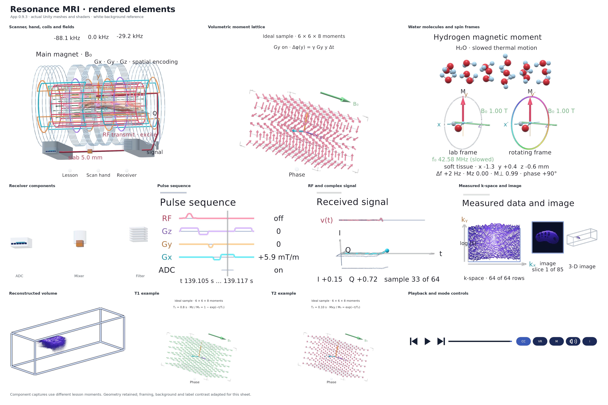
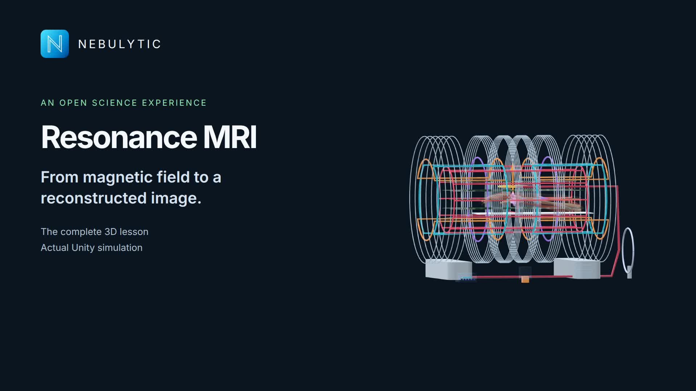
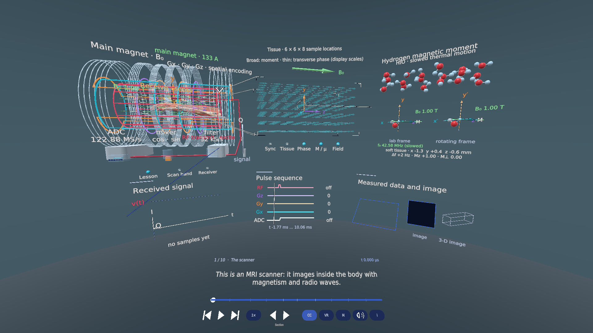
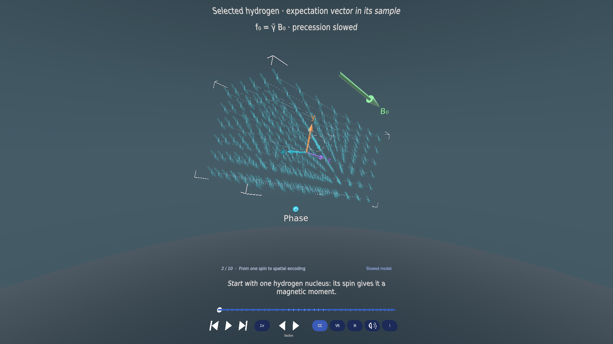

# Resonance MRI

An open-source, spatial MRI teaching experience built in Unity for **Meta Quest 3 passthrough / VR** and **Windows desktop**. Follow a simulated hand from magnetic fields and hydrogen moments to received signals, spatial encoding, k-space and reconstruction.

**Current Quest preview: 0.9.5 (build 18).** The original [0.9.3 baseline](https://github.com/ajinkyagorad/Resonance-MRI/releases/tag/v0.9.3) remains available. This is an educational simulation with a synthetic acquisition of an anatomical model. It does not measure the user's hand. The existing lesson content is preserved; the [public roadmap](#public-roadmap) records the next improvements.



[**App website**](https://nebulytic.com/apps/resonance-mri/) · [**Privacy**](https://nebulytic.com/apps/resonance-mri/privacy) · [**Support**](https://nebulytic.com/apps/resonance-mri/support) · [**Try the earlier WebXR experience**](https://build.nebulytic.com/demos/mri/) · [**Hetzner build page**](https://build.nebulytic.com/) · [**Individual renders**](docs/renders/README.md) · [**44 style concepts**](docs/design-studies/README.md) · [**Physics and receiver audit**](docs/PHYSICS.md)

The WebXR link is the earlier browser implementation with a different specimen and UI; this repository contains the native Unity project. The build page and [Quest 0.9.5 APK](https://build.nebulytic.com/dl/resonance-quest/Resonance-MRI-Quest-0.9.5.apk) / [Windows 0.9.4 ZIP](https://build.nebulytic.com/dl/resonance-quest/Resonance-MRI-Windows-0.9.4.zip) currently require the host's login. Public source access here requires no build-server account. The [GitHub 0.9.5 release](https://github.com/ajinkyagorad/Resonance-MRI/releases/tag/v0.9.5) includes the corrected release-signed Quest APK. The Windows package remains in the [0.9.4 release](https://github.com/ajinkyagorad/Resonance-MRI/releases/tag/v0.9.4).

## Watch the complete lesson

[](https://www.youtube.com/watch?v=jU3K3tr13xE)

[Watch on YouTube](https://www.youtube.com/watch?v=jU3K3tr13xE) or [watch on the app page](https://nebulytic.com/apps/resonance-mri/#full-lesson). All ten chapters are rendered from the actual Unity scene with focused camera shots, narration and English captions. [Transcript, captions, production sources and validation](docs/video/README.md). The film is available by link; the Quest build remains a preview while the Meta Horizon release is prepared.

## What is implemented

- Exposed main magnet, gradient windings, transmit birdcage and independent receive surface loop.
- Hand anatomy linked to a persistent **6 × 6 × 8 volumetric moment lattice**, with separate single-spin / ensemble teaching models.
- Laboratory and rotating-frame views, RF excitation, T1 / T2 examples, slice selection, Gx frequency encoding and repeated Gy phase encoding.
- One simulation clock driving the specimen, magnification, sequence, receiver trace, acquired k-space and image.
- Full hand slice coverage, controller and desktop interaction, movable views, MR / VR, two narration voices, mute and playback controls.

The current reconstruction has limited visible signal coverage and contrast. Visibility of the narration marker, layout and teaching clarity remain active issues. The figures below are actual server Unity renders; snapshots use different lesson times.

| Moment lattice | Molecular and spin view |
|---|---|
|  |  |

| Acquired k-space and image | Current reconstructed volume |
|---|---|
|  |  |

## Android packaging update 0.9.5

The final APK now uses **installLocation=auto**, enforced in build configuration, the generated manifest and the artifact checks. All 61 APK checks pass. Runtime and lesson content are unchanged from 0.9.4. [Correction and evidence](Docs/AI/Revision-0.9.5.md).

## New in 0.9.4

Drag the narration timeline, move between sections without replaying a chapter, and choose **1× / 2× / 4×** playback with speech pitch preserved. Paused navigation stays paused. On desktop, use comma/period for sections and S for rate.

The single-spin example keeps all **288 sample moments** visible as translucent context, anchors its marker to the chosen sample, and gives transverse phase projections a different size and opacity. The information card includes a GitHub link. [Revision details](Docs/AI/Revision-0.9.4.md).

| Current playback controls | Single-spin volume context |
|---|---|
|  |  |

## Build or work with an AI coding agent

Clone this repository and give your agent this README plus [AGENTS.md](AGENTS.md). A useful starting request is:

> Read README.md, AGENTS.md, docs/PHYSICS.md and docs/ROADMAP.md. Explain the existing simulation and rendering boundaries, select one roadmap item, implement it without replacing measured data with decorative imagery, run the relevant checks, and provide actual before/after Unity renders.

Requirements: Unity **6000.5.5f1**, Android Build Support with SDK/NDK/OpenJDK for Quest, Windows build support for the desktop player, and .NET 8 for the numerical checks. Unity and Meta dependencies retain their own licenses; access to this code is free under the licenses below, while engine/service eligibility depends on their terms.

1. Open this directory in Unity Hub; allow the pinned packages to resolve.
2. Open `Assets/Scenes/Resonance.unity`. Use `ResonanceBuild.Configure` through batch mode to regenerate the scene and package references when needed.
3. Build with the public wrapper, or use the Editor entry points below. No narration server is required for the checked-in audio.

```sh
git clone https://github.com/ajinkyagorad/Resonance-MRI.git
cd Resonance-MRI
dotnet run --project Tools/simcore/simcore.csproj -c Release -- test
# Linux / headless examples:
export UNITY_EDITOR=/path/to/Unity/Editor/Unity
bash Tools/build-public.sh android
bash Tools/build-public.sh windows
bash Tools/build-public.sh render
```

On headless Linux the wrapper uses graphics under xvfb; Android builds require graphics to retain the Vulkan XR boot settings. The wrapper uses the real project's build/export entry points and stores results in `Builds/` and `validation/`. Run only one Unity Editor against a project directory. The older server scripts remain as historical automation and contain installation-specific paths. For fresh Windows-only setup, run `ResonanceBuild.Configure` once before `ResonanceBuild.BuildWindows`.

The simulation core is in `Assets/Resonance/Runtime/Sim/`; spatial views and interactions in `Assets/Resonance/Runtime/Scene/`; shaders in `Assets/Resonance/Shaders/`; lesson data and both voices in `Assets/Resources/`; build / validation tools in `Assets/Resonance/Editor/`. [The existing transcript](Docs/AI/TRANSCRIPT-0.9.3.md) and [model limits](Docs/AI/Revision-0.9.3.md) are included.

## Public roadmap

- [ ] **Attention marker:** give the exact narrated entity a readable contour / halo and restrained motion; keep the marker visible when geometry occludes it. Match the highlighted field, coil, voxel group or plot segment to each phrase.
- [ ] **Missing physical chain:** teach intrinsic proton spin and magnetic moment → magnetic interaction and precession → resonant RF tipping → ensemble transverse magnetization → changing linked flux and induced receiver voltage.
- [ ] **Receiver audit and visualization:** distinguish analog front end, ADC, FPGA NCO / mixer / CIC, host FIR / decimation, clocks and signal units. Document each chosen architecture and parameter against primary sources.
- [ ] **Voxel encoding:** show two locations sharing x but differing in y, the summed signal, successive Gy phase encodes, k-space accumulation and inverse reconstruction together.
- [ ] **Synchronization and visibility:** keep hand ROI, slab, lattice, molecule, axes, fields and plots linked; verify readable depth and placement on Quest.
- [x] **Design studies:** four calm alternatives for each rendered component—minimalist, fully informative, advanced aesthetics and elegant—reviewed separately from implemented screenshots.
- [ ] **Relaxation and material effects:** distinguish T1, T2 and T2*, susceptibility / chemical shift, molecular motion and RF loading.
- [ ] **Reconstruction and experimentation:** improve coverage / contrast, show slice width versus spacing, and provide a clearly bounded sandbox for protocol and specimen changes.
- [ ] **Device and release work:** physical Quest profiling and controller checks, readable narration controls, Horizon App ID / release signing and Store validation.
- [x] **In-app source access:** a GitHub link in the existing information area.

See [the detailed roadmap and acceptance criteria](docs/ROADMAP.md). These are planned improvements; publication does not claim they are finished.

## Validation and status

The 0.9.4 reports record **95 runtime checks, 33 playback checks and 60 APK checks**, with successful Quest and Windows builds. The unchanged simulation core passed **66 numerical checks** from a fresh public clone. [Versioned evidence](docs/validation/README.md) and the 0.9.3 reports are included. Render export is a separate headless-Editor operation; Linux Editor OVRPlugin and SearchDatabase environment warnings are documented separately from application checks.

Physical headset readability, controller alignment and sustained frame rate still require device testing. The current APK is a preview, and no Horizon Store approval is claimed. [Horizon submission preparation](docs/HORIZON.md) records artwork, account setup and device validation. Passthrough must work without asking the user to draw or enable a play boundary where the platform supports it. The mixed MR / VR implementation uses contextual boundary suppression and restores boundary behavior for opaque VR; this must be validated on a supported Quest runtime. Official Touch Plus models are used with controller help off by default, focus-loss release and input animation; physical alignment and haptics remain device checks.

## License and credits

Original application code is under the [MIT License](LICENSE). Project-authored documentation and renders are offered under [CC BY 4.0](https://creativecommons.org/licenses/by/4.0/), subject to the third-party notices. Attribution: Resonance MRI contributors; anatomy: BodyParts3D, © The Database Center for Life Science, CC BY 4.0, modified.

Anatomy, fonts, Meta / Unity dependencies and narration provenance are listed in [THIRD_PARTY.md](THIRD_PARTY.md) and bundled notices. Meta SDK assets are resolved as dependencies; this repository does not relicense them as MIT. [Contribution guidance](CONTRIBUTING.md) welcomes both direct and AI-assisted changes.

