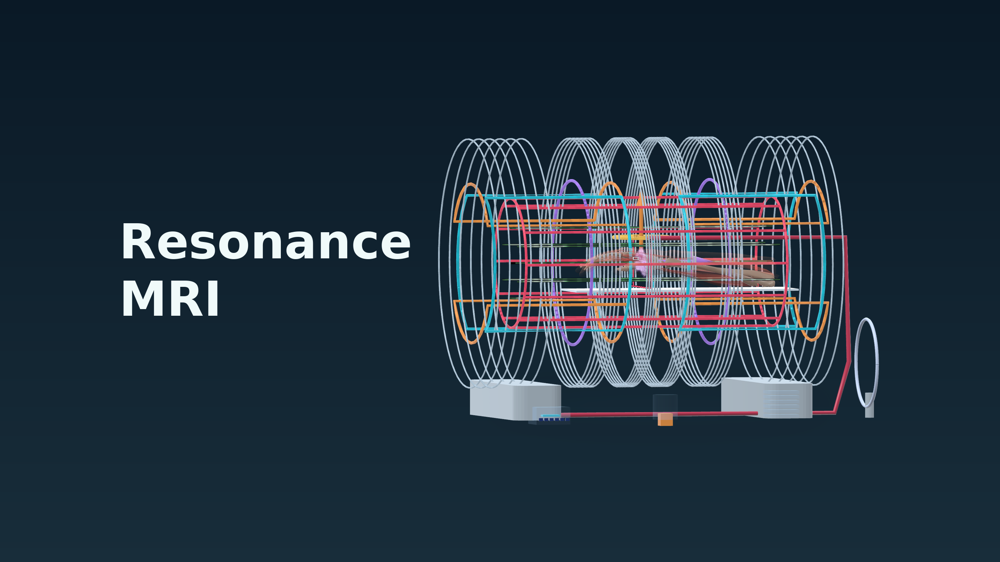

# Horizon Store submission preparation

Store title: **Resonance MRI**. Proposed price: **Free**. This is an educational simulation for Quest 3 / 3S; supported-device declarations remain subject to physical testing.

The local submission package contains a release-signed 0.9.5 inspection APK (version code 18, installLocation=auto), paste-ready listing, artwork, five real runtime screenshots, a 39.8-second H.264/AAC trailer, privacy and attribution documents, and validation evidence.



## Remaining account and device work

The user selected “new app”. A numeric Meta App ID, verified organization/publisher details, IARC and Data Use Checkup have not been supplied. The included preview is release-signed but does not yet run the Store entitlement path. It has not been uploaded or approved.

Create the new Quest app, then build with the actual numeric App ID:

```sh
export RESONANCE_META_APP_ID='YOUR_ACTUAL_NUMERIC_APP_ID'
export UNITY_EDITOR=/path/to/Unity/Editor/Unity
bash Tools/build-public.sh store
# On the existing signing host:
python3 Tools/sign-release.py --store
```

BuildStore rejects missing/non-numeric/zero IDs. The Store build embeds the ID, enables RESONANCE_STORE, and checks entitlement before starting the lesson. Signing credentials stay outside Git and cloud-synced folders. The signing helper's default SDK/key paths describe the existing build host; adapt them securely for another host.

Install through a non-production Meta release channel and verify entitlement, launch/loading, MR/VR boundary transitions, both input modalities, focus loss, narration controls, readability and sustained compositor performance. Record physical evidence. Server checks do not establish Store readiness.

## Assets and provenance

[Artwork and screenshots](store/) are generated from the current Unity runtime on Hetzner. Screenshots show the app's native VR studio, with no added logos or annotations. Branded covers use isolated actual scanner geometry, all conductors illuminated for clarity, a background and the title. They are compositions, distinct from screenshots.

The trailer replays exact lesson timestamps and assembles the matching shipped voice clips. It is a server runtime capture, not a physical-headset recording. Generated [style studies](design-studies/README.md) are excluded from Store screenshots.

Required notices are in [THIRD_PARTY.md](../THIRD_PARTY.md); the public [privacy policy](https://nebulytic.com/apps/resonance-mri/privacy) describes the implementation and planned Store entitlement flow.

Current official references, checked 25 September 2026:
- [Meta asset design guidelines](https://developers.meta.com/horizon/resources/asset-guidelines/)
- [App metadata](https://developers.meta.com/horizon/resources/publish-app-metadata/)
- [Android manifest requirements](https://developers.meta.com/horizon/resources/publish-mobile-manifest/)

## Manifest correction

Use the [0.9.5 Quest APK](https://github.com/ajinkyagorad/Resonance-MRI/releases/tag/v0.9.5) for further preparation. [Final APK manifest evidence](validation/0.9.5/apk-manifest.txt) records installLocation=0. Store media remains the actual 0.9.4 imagery because runtime content is unchanged.

## Public website

The [app page](https://nebulytic.com/apps/resonance-mri/), [privacy policy](https://nebulytic.com/apps/resonance-mri/privacy), [support](https://nebulytic.com/apps/resonance-mri/support) and [licences](https://nebulytic.com/apps/resonance-mri/terms) are maintained in the Nebulytic website repository and published through its GitHub-to-Cloudflare workflow. This repository remains the public Unity source and release archive.
