# Four styles for each spatial element

These **11 sheets contain 44 AI-generated design concepts**, derived from the [actual Unity component renders](../renders/README.md) of the preserved 0.9.3 baseline. They explore materials, contrast, annotation and attention cues. They are separate from the implemented app and are excluded from Store screenshots.

Each sheet compares **Minimalist**, **Fully informative**, **Advanced aesthetics** and **Elegant**. The original rendered source is linked beside it. Generation prompts and correction history are preserved in [prompts/](prompts/).

## Review rules

- Use these to select a visual direction. Rebuild geometry, axes and every label from the authoritative simulation and reviewed lesson data.
- The tissue glyphs represent sampled expectation or ensemble magnetization, with different teaching modes. A lattice is a display sampling arrangement, not the physical arrangement of individual nuclei.
- Maintain B0 along physical +z; x, y and z must share the scanner-to-tissue transform. Generated axis projection is approximate and must not become the implementation reference.
- The T1 sheet shows longitudinal components recovering; its “all moments” wording refers to displayed ensemble components, not every microscopic spin aligning.
- The scanner sheet explores material finishes. Its windings are this project's teaching geometry, not a manufacturer-certified instrument design. Full component labels and current directions still need exact authored anchors.
- K-space values come from acquisition; reconstructed slice coordinates are x-y. The height surface visualizes signal magnitude, not a third physical encoding dimension.
- Pulse, receiver and data views must follow the same measured clock. An attractive surface or trace never substitutes for acquired values.
- All playback functions remain available in an implemented style. Simplified control concepts do not authorize removing seeking, section navigation, rate, captions, voice or mute.
- Depth-independent markers should identify one exact object or region while the surrounding context remains visible.

The public [physics audit](../PHYSICS.md) and [roadmap](../ROADMAP.md) govern implementation. No visual direction has been selected or implemented from these sheets.

## Sheets

### 1. Scanner, hand and magnetic fields

[Actual Unity source](../renders/01-scanner.png) · [Generation brief](prompts/01-scanner.md)

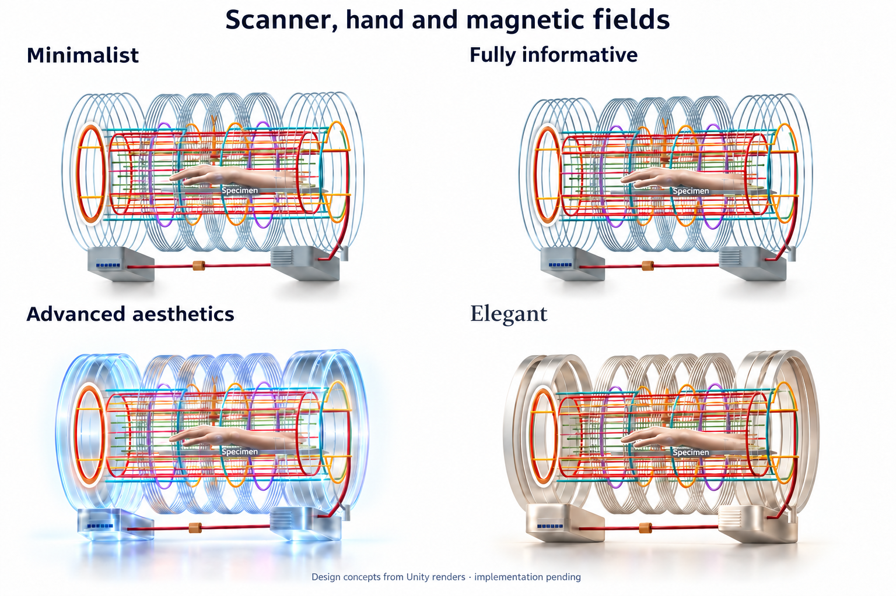

### 2. Volumetric moment lattice

[Actual Unity source](../renders/02-moment-grid.png) · [Generation brief](prompts/02-moment-grid.md)

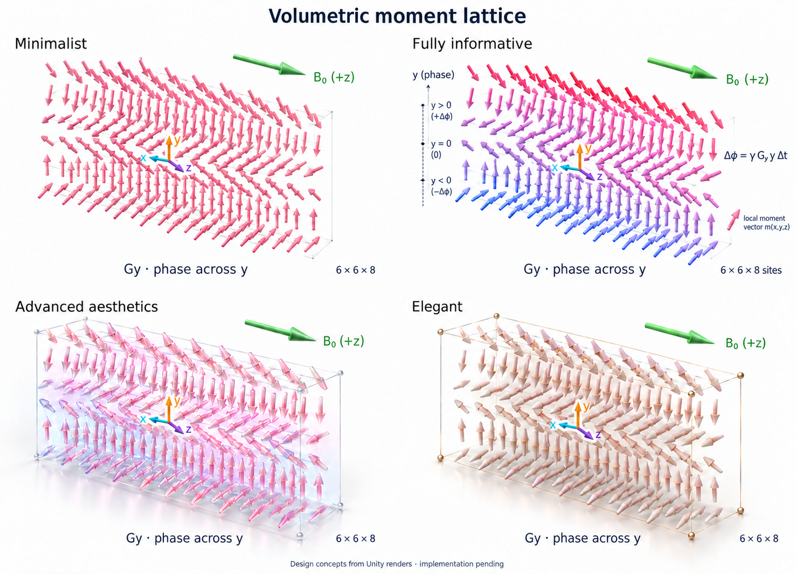

### 3. Molecules and hydrogen magnetic moment

[Actual Unity source](../renders/03-molecules-and-spin.png) · [Generation brief](prompts/03-molecules-and-spin.md)

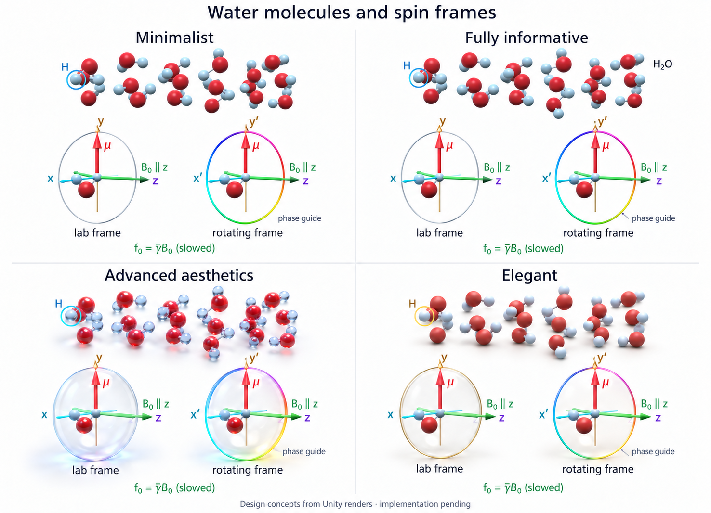

### 4. Receive electronics

[Actual Unity source](../renders/04-receiver.png) · [Generation brief](prompts/04-receiver.md)

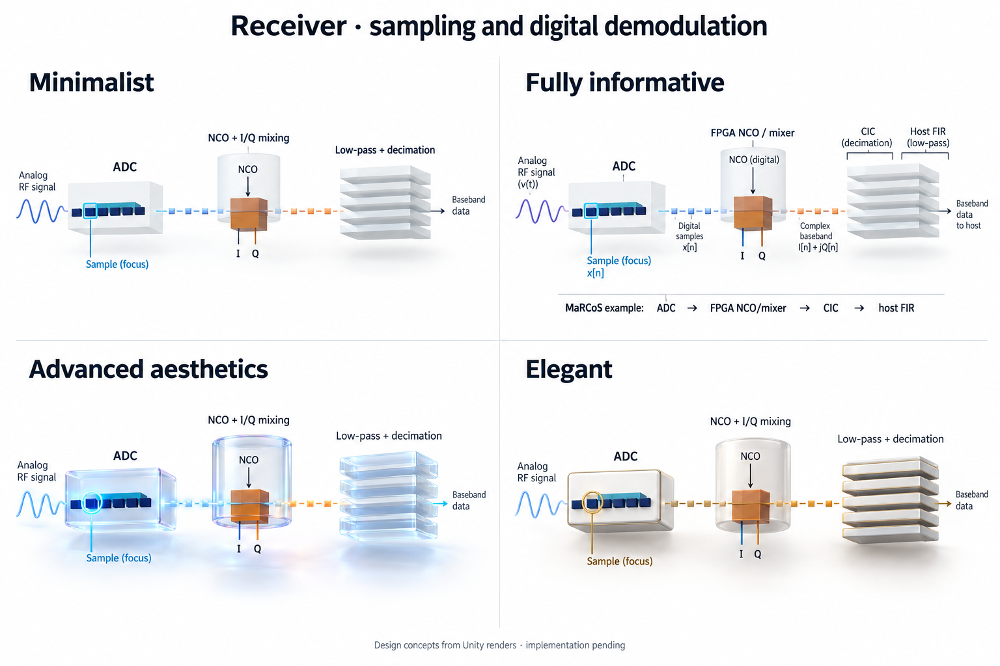

### 5. Pulse sequence

[Actual Unity source](../renders/05-pulse-sequence.png) · [Generation brief](prompts/05-pulse-sequence.md)

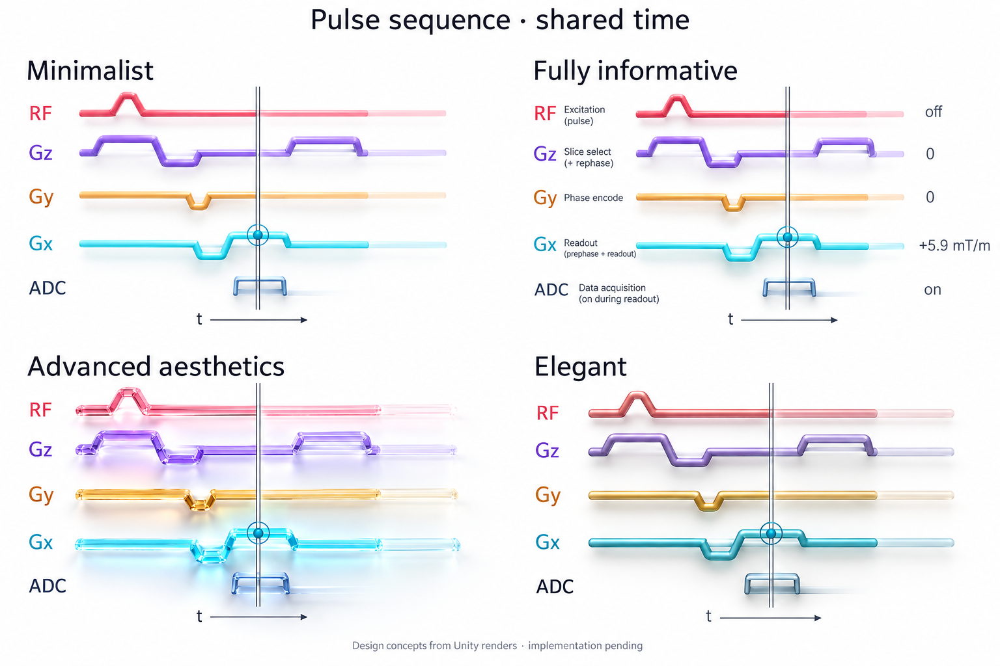

### 6. Received RF and I/Q signal

[Actual Unity source](../renders/06-rf-and-iq.png) · [Generation brief](prompts/06-rf-and-iq.md)

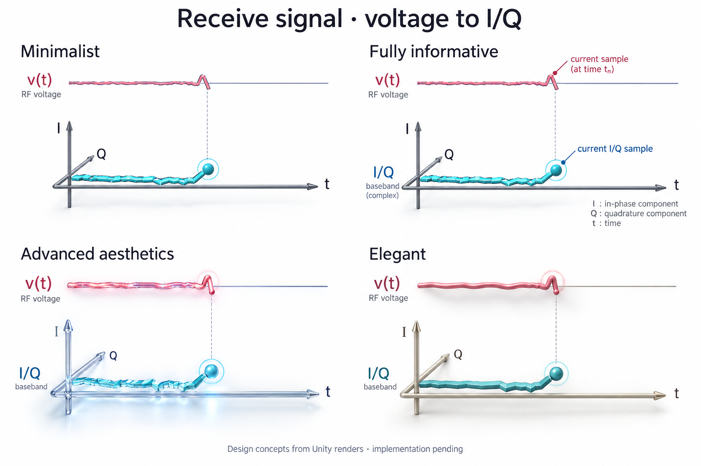

### 7. Measured k-space and reconstructed image

[Actual Unity source](../renders/07-kspace-and-image.png) · [Generation brief](prompts/07-kspace-and-image.md)

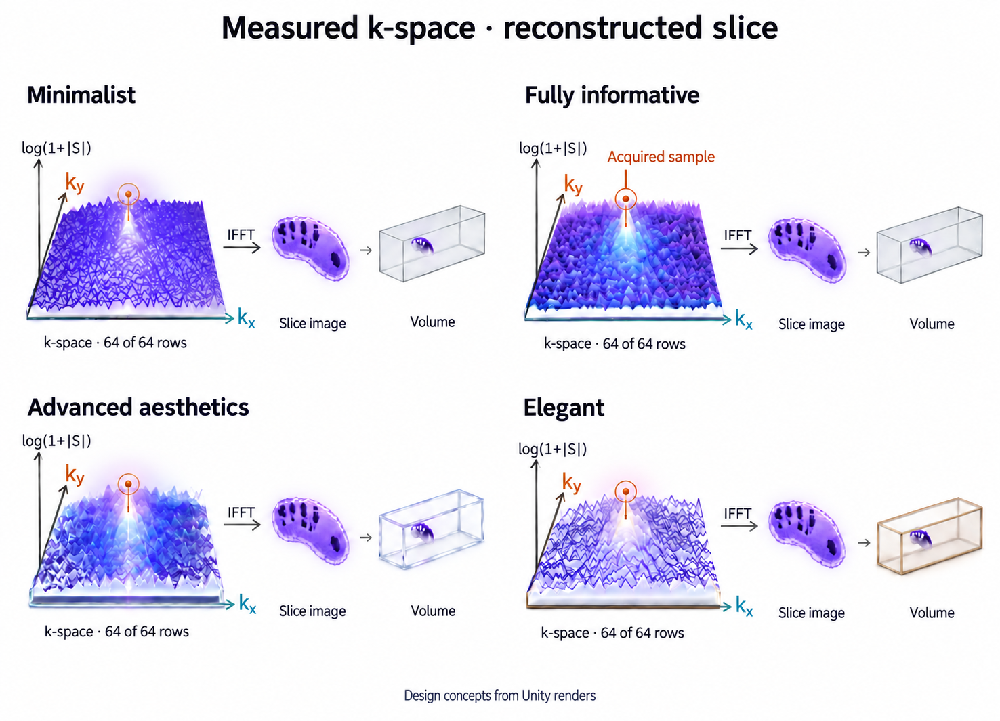

### 8. Current reconstructed volume

[Actual Unity source](../renders/08-reconstructed-volume.png) · [Generation brief](prompts/08-reconstructed-volume.md)

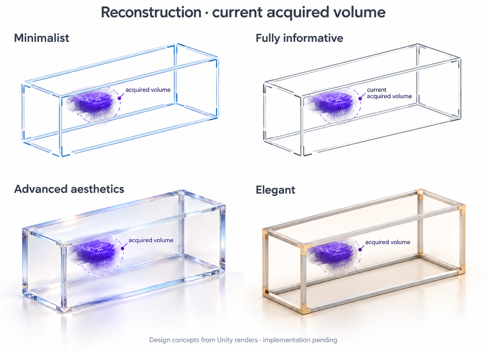

### 9. T1 longitudinal recovery

[Actual Unity source](../renders/09-t1-recovery.png) · [Generation brief](prompts/09-t1-recovery.md)

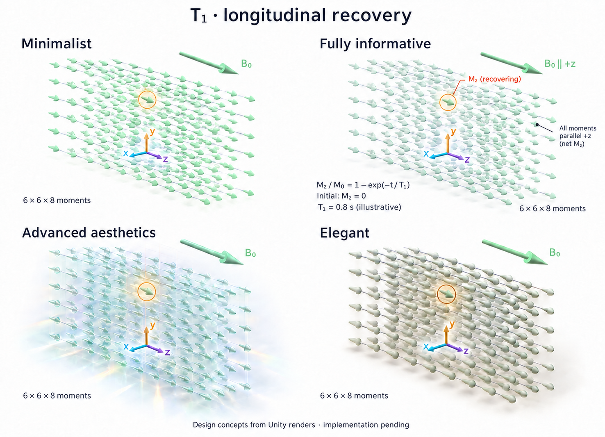

### 10. T2 transverse coherence

[Actual Unity source](../renders/10-t2-coherence.png) · [Generation brief](prompts/10-t2-coherence.md)

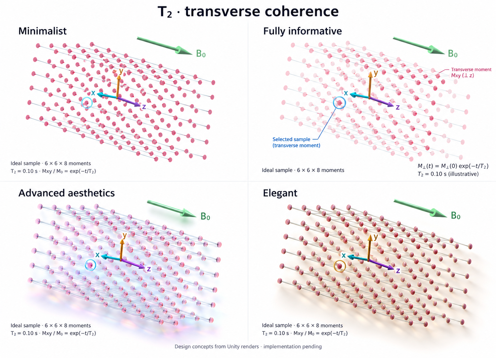

### 11. Playback and narration controls

[Actual Unity source](../renders/11-controls.png) · [Generation brief](prompts/11-controls.md)

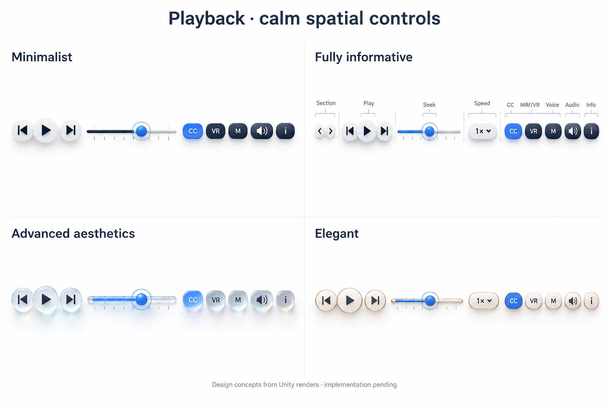

## Provenance

Concepts generated with the image generation tool on 25 September 2026, using the project's actual Unity renders as references. Source anatomy: BodyParts3D, © The Database Center for Life Science, CC BY 4.0, modified. See [THIRD_PARTY.md](../../THIRD_PARTY.md). Project-authored concept sheets and prompts are offered under CC BY 4.0, subject to those notices.

