# Actual Unity element renders

These are captured from the 0.9.3 Unity runtime on Hetzner. The exporter changes background, camera framing and label / transport contrast for white-background readability. Meshes and simulation data remain from the app. Each image uses a different documented lesson time.

[Combined 4800 × 3200 sheet](MRI-rendered-elements-white-0.9.3.png) · [Individual PNGs and capture metadata](MRI-rendered-elements-source-0.9.3.zip)

## Scanner

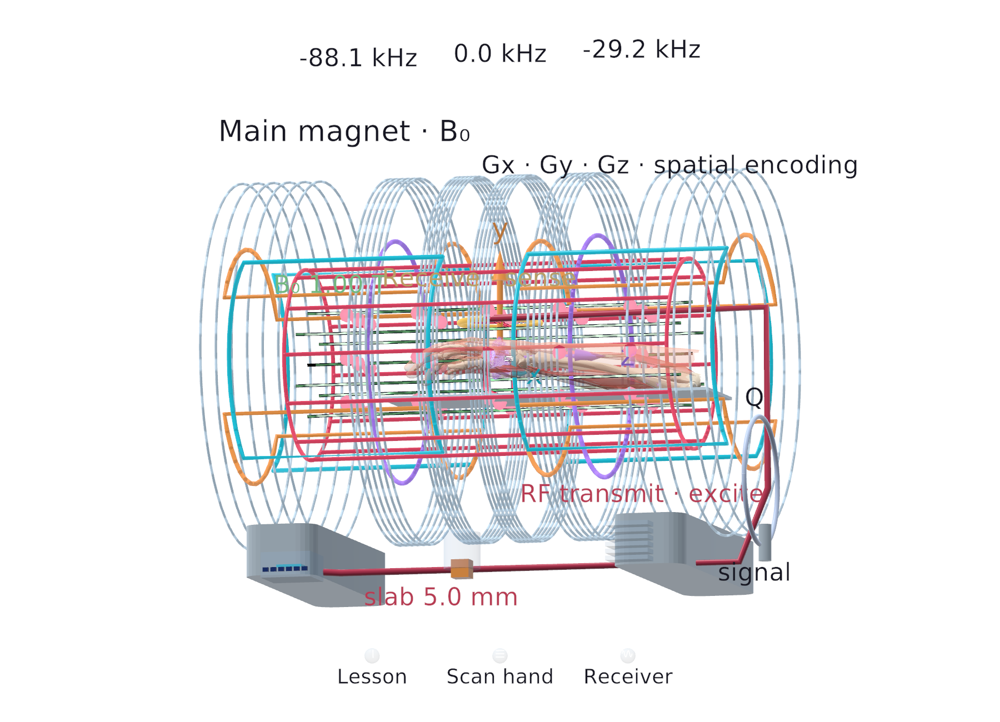

## Moment grid

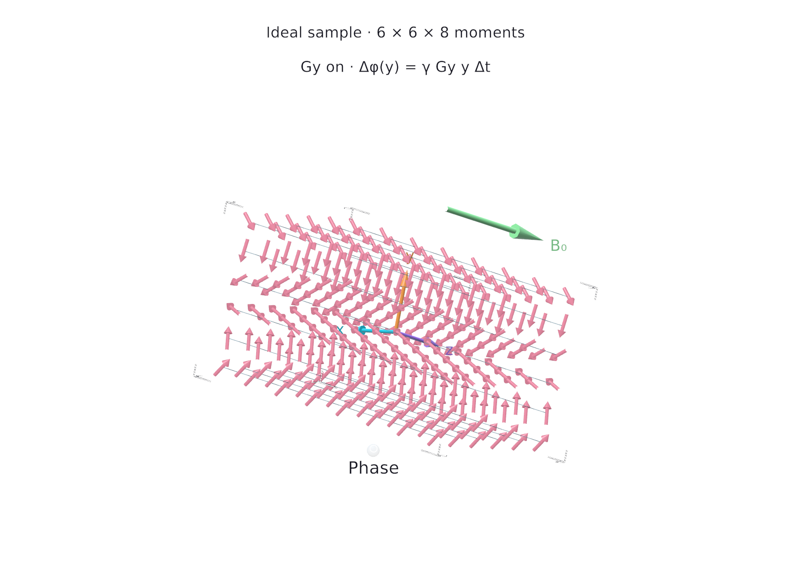

## Molecules and spin

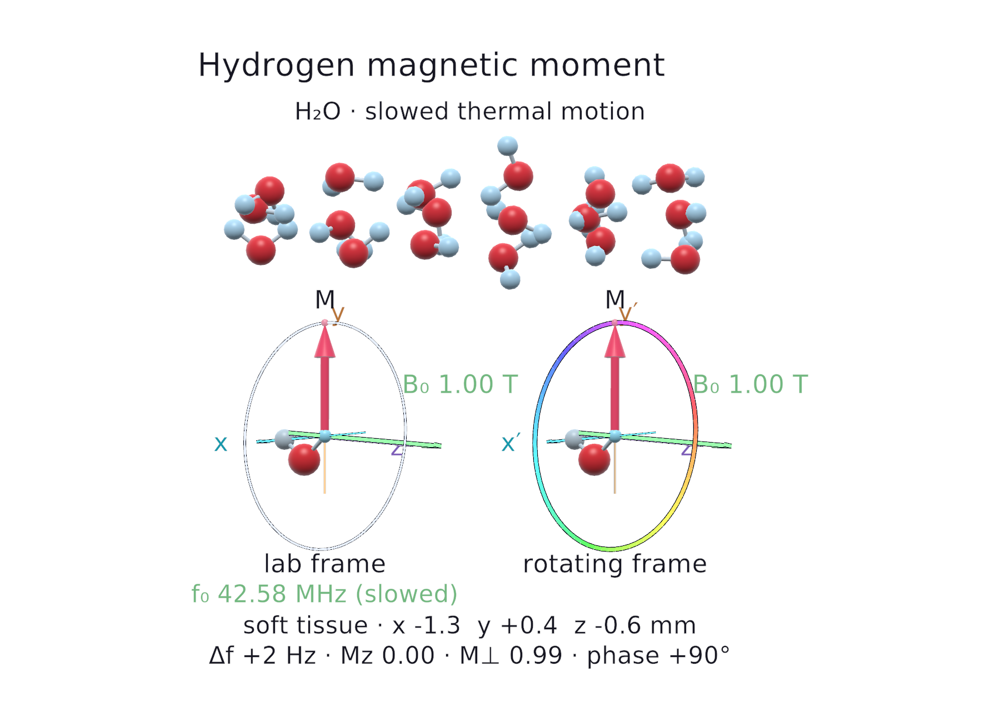

## Receiver

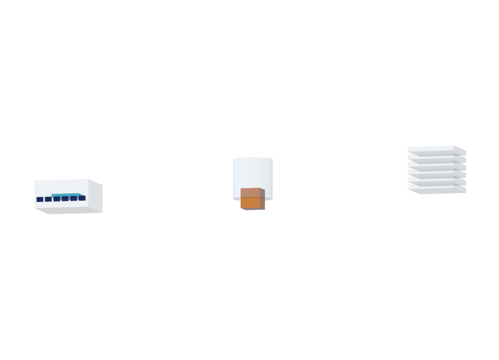

## Pulse sequence

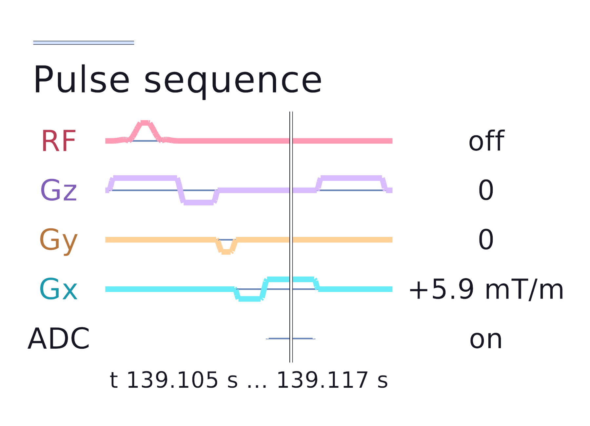

## Rf and iq

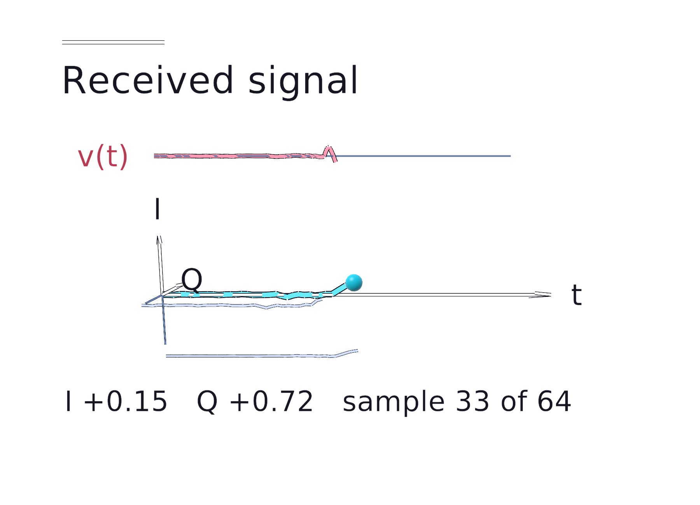

## Kspace and image

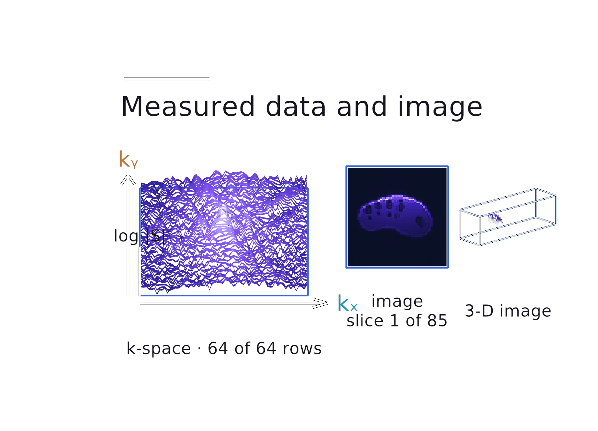

## Reconstructed volume

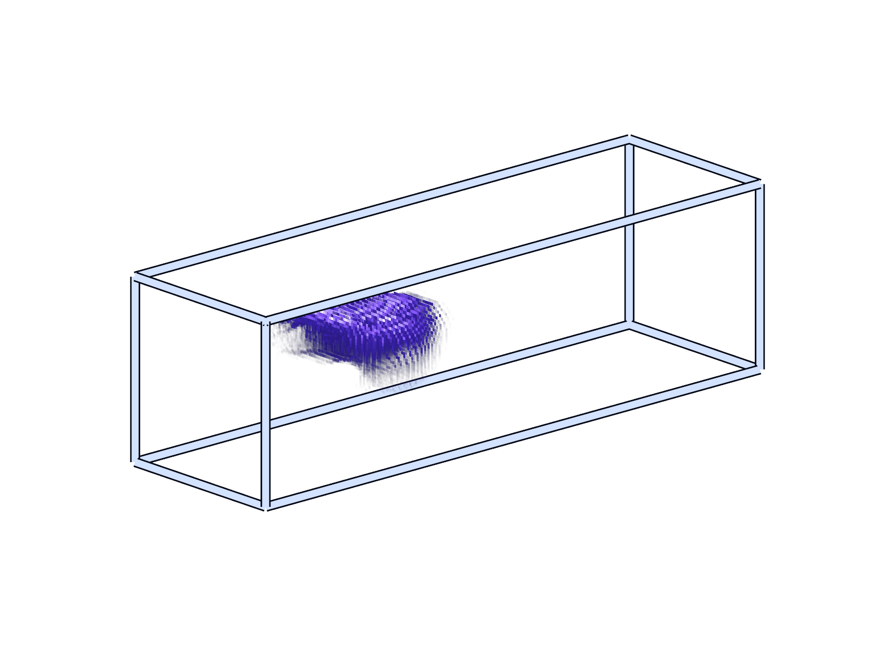

## T1 recovery

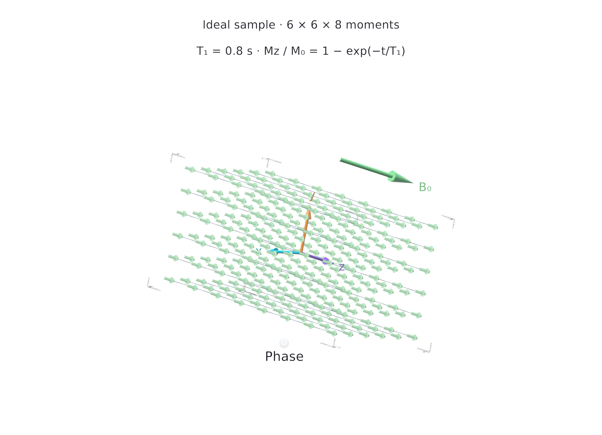

## T2 coherence

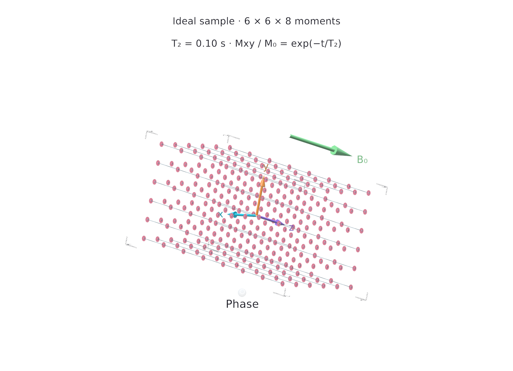

## Controls

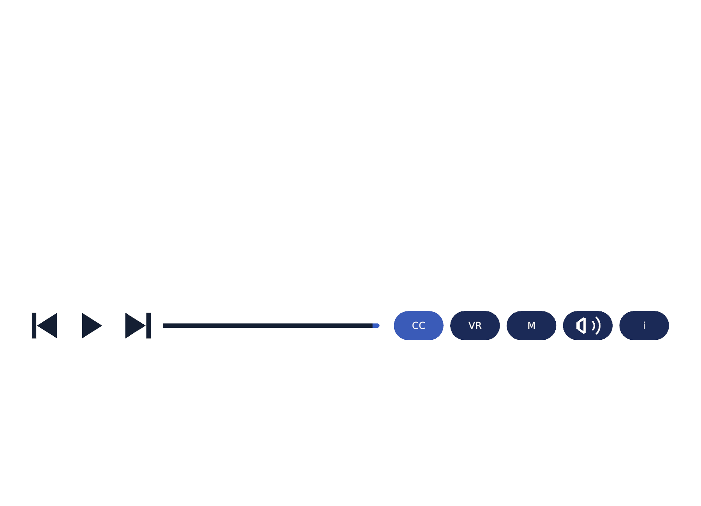

